# SQLNI

<p>
    <a href="https://github.com/Kekwy"></a>
    
    <a href="https://github.com/mybatis/mybatis-3"></a>
    <a href="https://opensource.org/licenses/MIT"></a>
    
    
</p>

> 1. 基于 Mybatis 实现对不同方言数据库编写统一查询的 DSL 语言工具。
> 2. 使用统一方式编写针对不同数据库方言的 MyBatis 可识别的 XML 文件。
> 3. 通过统一的 DSL 编写查询，并根据指定的 SQL 模板，自动生成针对不同数据库方言，MyBatis 可以直接使用的 XML 文件。
> 4. 自动生成 MyBatis 中定义 Mapper 的 XML 映射文件，并且支持多数据库方言。
> 5. 再考虑如何组织一下语言。。。
>
> 示例仓库：[Kekwy/sqlni-examples](https://github.com/Kekwy/sqlni-examples)

##  目录

**[1 项目简介](#1-项目简介)**

**[2 快速开始](#2-快速开始)**

​	[2.1 添加依赖](#21-添加依赖)

​	[2.2 定义查询](#22-定义查询)

​	[2.3 执行查询](#23-执行查询)

**[3 WHERE 子句](#3-WHERE-子句)**

## 1 项目简介

SQLNI 项目是一个针对 MyBatis 的辅助工具，可以帮助用户根据用户定义的查询自动生成对应的针对不同数据库方言的 XML 映射文件。用户只需在自定义的 Mapper 接口上添加注解 `@UseSQLNI` 并使用 SQLNI 语言编写查询语句，并在 pom 文件中添加配置、设置数据库方言，最后构建项目，即可完成 XML 文件的自动生成。

SQLNI 语言是一种 SQL-like 的 DSL，在标准 SQL 的基础上进行部分拓展，将不同数据库方言中功能相同的函数统一命名，并且支持表达 MyBatis 中动态 SQL 的语义。

生成 XML 文件时，默认根据 Mapper 接口中方法的返回值类型，自动设置对应查询的 resultType 属性。除此之外，还支持用户自定义 resultMap 用于处理指定方法的查询结构。 

支持的 SQL 语句：SELECT；

支持的数据库方言：MySQL、Oracle。

项目的主要目标：

1. 将持久化层与数据库方言解耦合，在开发 Mapper 接口时不必关注未来需要部署的具体数据库的方言；
2. 提高项目的可维护性，对于在不同数据库环境中部署的项目，开发者只需维护一套查询语句；
3. 提高项目的可移植性，对已经部署的项目需要更改使用的具体数据库时，只需更改 SQLNI 的配置信息，重新构建项目即可，而不必修改代码，不必重新编写 SQL 语句；
4. 在实现上述目标的基础上，保留 MyBatis 原有的灵活性，通过对标准 SQL 进行拓展，使用户可以使用 SQLNI 语言表达动态 SQL 的语义；
5. **降低学习成本**：现有的许多项目（如 Calcite、querydsl）提供了 SQL 方言间的转化功能，但其提供的 API 较多，学习成本较高；而本项目仅向外提供 `@UseSQLNI` 注解作为 API，用户不需要额外编写代码，易上手，易使用。

## 2 快速开始

### 2.1 添加配置

```xml
<plugin>
  <groupId>org.apache.maven.plugins</groupId>
  <artifactId>maven-compiler-plugin</artifactId>
  <version>3.8.1</version>
  <configuration>
    <source>17</source>
    <target>17</target>
    <encoding>UTF-8</encoding>
    <annotationProcessors>
      <annotationProcessor>
        com.kekwy.sqlni.UseSQLNIProcessor
      </annotationProcessor>
    </annotationProcessors>
    <compilerArgs>
      <arg>-ASQLTemplates=MySQL</arg>
    </compilerArgs>
  </configuration>
</plugin>
```


### 2.2 定义查询


输出结果不依赖用户对关键字的具体书写形式，使用 SQL 模板中对相应关键字的定义统一进行格式化输出。

### 2.3 执行查询


### 2.4 使用参数


## 3 WHERE 子句


## 4 SELECT 语句


## 5 开发者

### 5.1 扩展 SQLNI

自定义函数模板

自定义关键字

自定义函数

自定义运算符（仅支持双目运算符）

```java
public class MySQLTemplates extends SQLTemplates { // 自定义 SQL 模板并继承 SQLTemplates 类
    public MySQLTemplates() {
        super("MySQL"); // 设置模板对应的数据名称，不可重复（作为语法分析树 cache 中的键）
        addFuncTemplate("concat", "concat({0}, ...)"); // 编写自定义的函数模板
    }
}
```

### 5.2 调试

```shell
mvnDebug clean install
```

## 6 更新记录


1. 可以对整个 Mapper 接口或其中某些方法指定不同的 SQL 模板；
2. 在示例项目中编写测试，进行成果检验；
3. 实现现阶段的所有功能，发布 1.0 版本。

**2024-2-2 更新说明**：

1. 生成 XML 文件时在每个方法对应的标签结点之间添加注释进行分隔，提高 XML 文件的可读性；

2. 增加对 `BETWEEN AND` 子句的支持；

3. 增加对 `IS NULL` 子句的支持；

4. 增加对 `NOT` 子句的支持；

5. 调整 conditions 规则的定义，使其可以更好地支持复杂条件：

   定义：

   ```antlr
   conditions
       : condition                             # singleCondition
       | NOT conditions                        # notConditions
       | '(' conditions ')'                    # subConditions
       | conditions opt=(AND|OR) conditions    # multiCondtions
       ;
   ```

   测试语句：

   ```text
   SELECT item1, #{paramCol} FROM t_table WHERE NOT (NOT col1 = n1 AND col2 = n2) AND (col2 = n3 OR col3 = n3) AND col4 IN [#{paramSet}];
   ```

   语法树（注意 SQLNI 语法变现为对 SQL 语法的拓展但其目的是生成 MyBatis 可用的 XML 文件，而不是直接执行 SQL 语句，故在 SQLNI 的语法树中，不体现 SQL 语句中 AND 与 OR 的优先级关系）：

   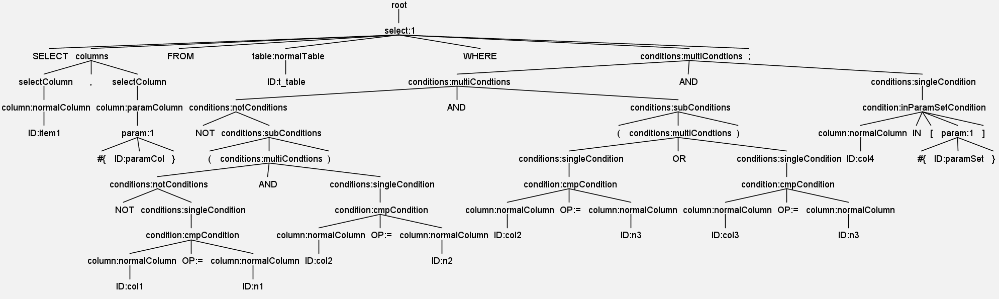

6. 由于先遍历到的分隔符或逻辑操作符应当先写入，故将 SQLNISerializer 中暂存分隔符或逻辑操作符的数据结构由栈改为队列；

7. **问题记录**：目前对分隔符或逻辑操作符的延迟写入机制较为混乱应考虑进行优化。

**2024-2-1 更新说明**：

1. 由于自动识别参数类型并展开会造成难以解决的歧义问题，故将该功能移除。转而通过定义额外 SQLNI 语法显示指明 SQLNI 语句中的集合类型参数。

**2024-1-31 更新说明**：

1. 根据 Mapper 接口中的方法参数对 SQLNI 中出现的对应参数进行额外处理，对于集合类型的参数需要根据其出现的位置利用 `<foreach>` 标签进行展开，若 SQLNI 语句中出现方法参数之外的参数，需要报错并向用户输出提示信息；
2. 增加对 `AS` 关键字的支持。

**2024-1-30 更新说明**：

1. 增加对 resultMap 的支持；
2. 增加对 `ORDER BY` 字句的支持。

**2024-1-29 更新说明**：

1. 通过访问者模式，将 Node 类与生成 XML 文件的依赖包进一步解耦，优化 XML 工具类；
2. 增加对更多 SQL 语句和函数的支持；

**2024-1-28 更新说明**：

1. 调整架构，通过访问者模式解决 Oracle 方言需要通过子查询实现 limit 功能的问题；

2. 实现对 `inParamCondition` 规则的处理，支持生成 `<if>` 与 `<foreach>` 标签。

   在通过 `<foreach>` 标签遍历集合时，需要先通过 `<if>` 标签判空，若 IN 条件紧跟着 WHERE 关键字，则会自动在 WHERE 之后添加 `1 = 1` 恒等条件，保证语法正确。

   ```text
   SELECT * FROM t_employee WHERE department IN #{departmentSet};
   ```

   ```xml
   <select resultType="com.kekwy.sqlni.example.entity.Employee" id="getEmployeeWhoseDepartmentInSet">
     SELECT * FROM t_employee WHERE 1 = 1
     <if test="departmentSet != null"> 
       AND department IN
       <foreach item="departmentSetItem" index="index" collection="departmentSet" close="} " separator=", " open=" {">
         #{departmentSetItem}
       </foreach>
     </if>
   </select>
   ```

**2024-1-27 更新说明**：

1. 实现从 pom.xml 文件中读取注解处理器的配置信息，弃用原有配置文件；

**2024-1-25 更新说明**：

1. 将 SQLNIVisitor 类重构为 MethodBuilder 类的内部类，并将原 SQLNIVisitor 类中的静态常量，移动至 MethodBuilder 类中。
2. 将与 SQL 模板类的直接交互移动到 TemplatesUtil 中，实现单一职责。
3. 定义函数模板语法，将生成函数对应的 XML 文件的过程与 SQL 模板类解耦合，转而由 TemplatesUtil 类实现。前者只需向后者提供函数模板字符串，后者再根据相关语法进行解析。便于对函数模板进行拓展。
5. 完善 README 中的部分内容。
6. **问题记录（重要）**：当前实现思路较难满足实现 Oracle 方言下的 limit offset 功能时需要自动转化为子查询的需求。
7. **问题记录**：注解处理器通过 Spring Boot 的 @value 注解从 application.yml 中获取配置信息，因为编译器期 Spring Boot 项目并没有启动。

**2024-1-24 更新说明**：

1. 将 SQLNI 语法访问器的返回值改为 `List<Node>` 类型，调整访问器部分实现方式；

2. 在 SQLNI 语法中添加对 WHERE 与 LIMIT 语句的定义；

   ```sql
   select id, type from t_employee where conact(department, '_', name) = '测试部_张三' limit 2 offset 3 ;
   ```

   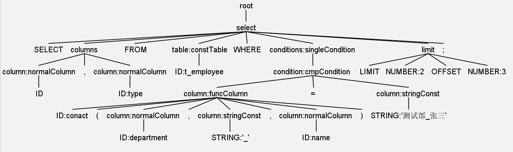

3. 实现从配置文件中读取用户指定的数据库，并据此使用对应的 SQL 模板；

4. 在 SQLNI 语法中添加对函数的调用，并定义 MySQL 和 Oracle 模板中的字符拼接操作；

5. 修复生成 XML 文件中 SQL 语句部分关键字之间未空格的问题。

## 7 参考资料

[1] MyBatis Dynamic SQL[EB/OL]. https://mybatis.org/mybatis-dynamic-sql/docs/introduction.html

[2] IntoTw. Java编译期注解处理器详细使用方法[EB/OL]. https://www.cnblogs.com/intotw/p/13815793.html

[3] baeldung. Java Annotation Processing and Creating a Builder[EB/OL]. https://www.baeldung.com/java-annotation-processing-builder

[4] 正则表达式 - 语法[EB/OL]. https://www.runoob.com/regexp/regexp-syntax.html

[5] [美]本·福达. SQL 必知必会(第 5 版)[M]. 钟鸣, 刘晓霞, 译. 北京: 人民邮电出版社, 2020.8

[6] [美]特恩斯·帕尔. ANTLR 4 权威指南[M]. 张博, 译. 北京: 机械工业出版社, 2017.5

[7] [美]Eckel, B. Java 编程思想(第 4 版)[M]. 陈昊鹏, 译. 北京: 机械工业出版社, 2007.6

[8] Querying SQL[EB/OL]. http://querydsl.com/static/querydsl/latest/reference/html/ch02s03.html


laskdjfklosadj lkasdj fglk;jsadl;zgfkkjAEWS:KIOD/fghjsdWOI'LJ GHKLJSDEF HBIKU;GVBFEWa:hLS GBUIKREWASY GLUEWWKSUHF DCF KIHEDSAJKFGHKDFJSHVKLSADHGKJHDS


访问者模式


## ANTLR 使用笔记（暂存草稿）

### 词法分析

**编写词法规则**：

- 语法分析器通过输入的词法符号流来识别特定的语言结构，而词法分析器通过输入的字符流来识别特定的语言结构。
- 开始编写一个新语法的时候，可以从一个已有的语法中复制一些常见的词法结构对应的规则：标识符、数字、字符串、注解，以及空白字符。
- 对于关键字、运算符和标点符号，我们一般无须声明词法规则，直接在语法规则中用单引号使用即可。但通过定义词法规则来引用，可以将语法规则与具体的词法表达解耦合。

**避免歧义**：

- 如 'enum' 这样的字符串常量被隐式定义为词法规则，然后放置在文法规则之后、显式定义的词法规则之前；
- 定义靠前的词法规则优先级更高；
- ID 等引起歧义的，可以匹配关键字的词法规则应该放在最后。


`fragment` 标注的词法规则本身不是一个词法符号，它只会被其他的词法规则使用。

**匹配字符串常量**：

```antlr
STRING : '\'' (ESC|.)*? '\'';     // 匹配字符常量，? 提供了对非贪婪匹配的支持

fragment
ESC : '\\"' | '\\\\';       // 双字符序列 \" 和 \\
```

实现上下文相关的语法

### 划定词法分析其和语法分析器的界线

**无扫描器的语法分析器**：把字符看作词法符号，然后用语法分析器来分析字符流的语法结构。

- 在词法分析器中匹配并丢弃任何语法分析器无须知晓的东西；
- 由词法分析器来匹配类似标识符、关键字、字符串和数字等常见词法符号；
- 将语法分析器无须区分的词法结构归为同一个词法符号类型；
- 将任何语法分析器可以以相同方式处理的实体归为一类；
- 如果语法分析器需要把一种类型的文本拆开处理，那么词法分析器就应该将它的各组成部分作为独立的词法符号输送给语法分析器。

语法分析器无须区分特定的词法结构或者无须关心某个词法结构的内容时，实际上的意思是我们编写的程序不关心它们。我们编写的程序对这些词法结构进行的处理和翻译工作和语法分析器相同。


尾递归/循环


### 不区分大小写的关键字

```antlr
SELECT: [Ss][Ee][Ll][Ee][Cc][Tt]
```


## DSL 相关定义（暂存草稿）

> https://zhuanlan.zhihu.com/p/110789982

### **DSL 的类别**

从使用方式的角度，语言可以划分出以下两类：

- DSL：使用 DSL 形式编写或表示的语言
- 宿主语言host language ：用于执行或处理 DSL 的语言

## 定义API过程的第一个例子（暂存草稿）

```xml
<select id="getEmployee" resultType="com.kekwy.mybatis.Employee">
  select * from t_employee where type=#{type}
  <if test="nameDepartmentSet != null">
    and
    <foreach collection="nameDepartmentSet" index="index" item="nd" open=" " separator="or" close=" ">         name||'_'||department=#{nd} 
    </foreach>
  </if>
</select>
```


```text
select * from t_employee where type = #{employeeType} and #|#&{"name":"foreach","attributes":{"close":" ","item":"departmentNameSetItem","separator":"or","open":" ","index":"index","collection":"departmentNameSet"}}#&concat(department, '_', name)=#{departmentNameSetItem}#|
```


## 问题记录

> https://mybatis.org/mybatis-dynamic-sql/docs/select.html

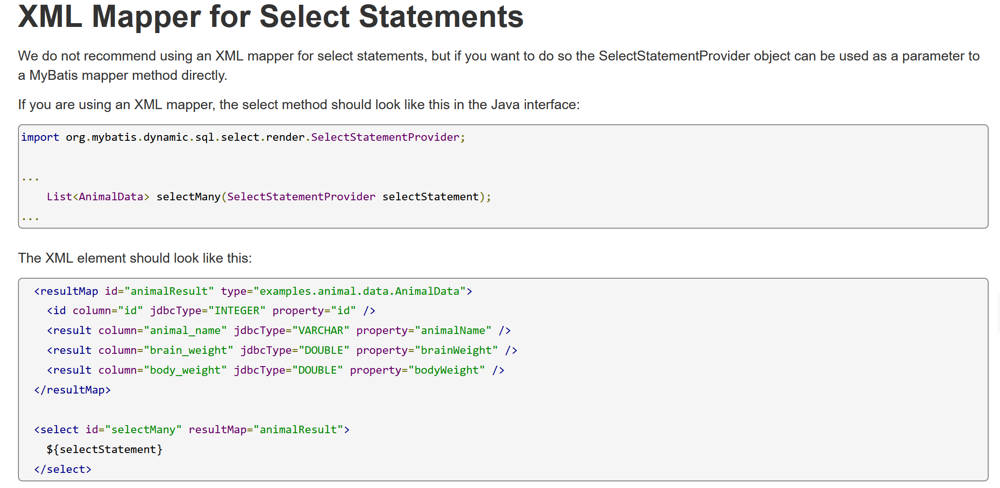

使用 Java API 表达字符串拼接

> https://mybatis.org/mybatis-dynamic-sql/docs/functions.html

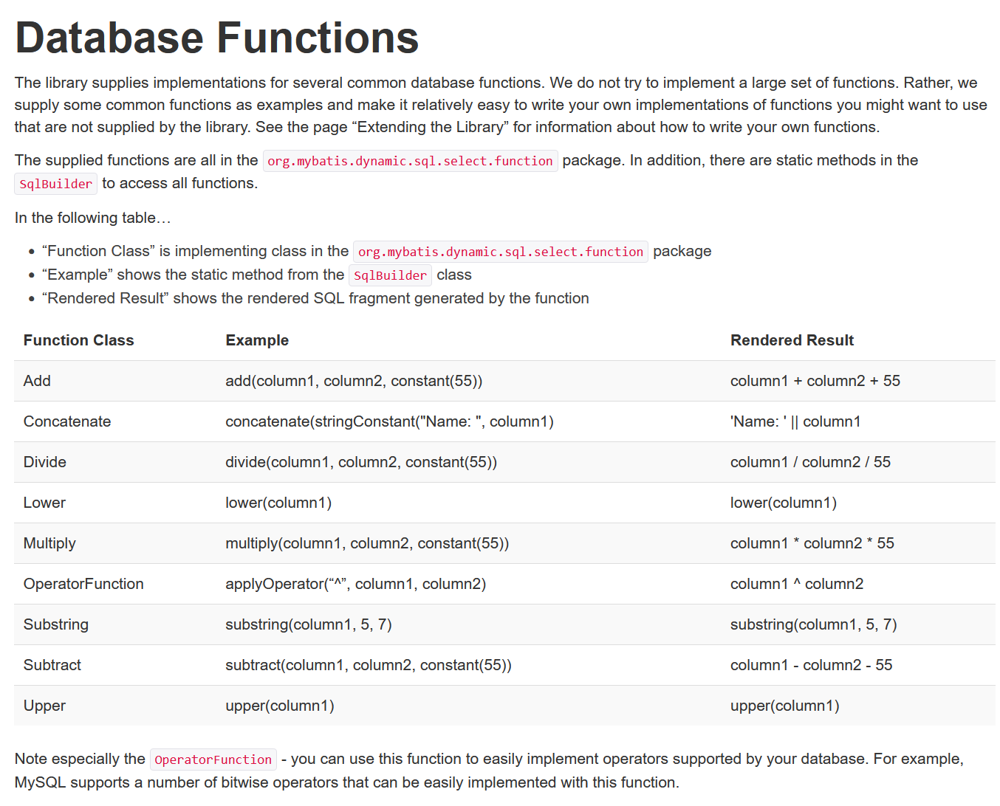

对 MyBatis Dynamic SQL 进行拓展

> https://mybatis.org/mybatis-dynamic-sql/docs/extending.html

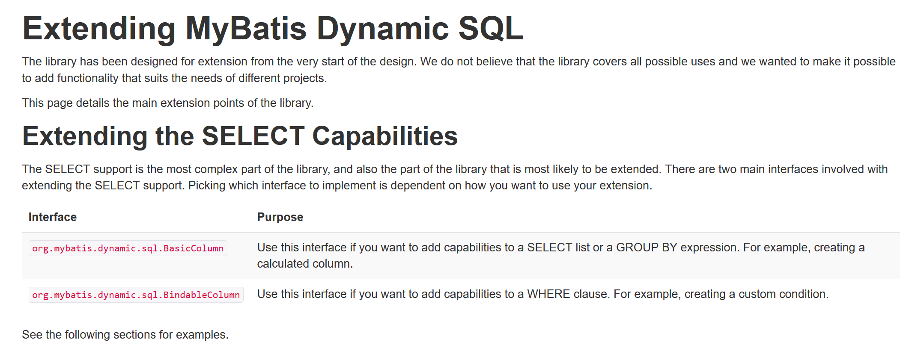

可以非常方便地对拥有不同方言的数据库进行拓展：

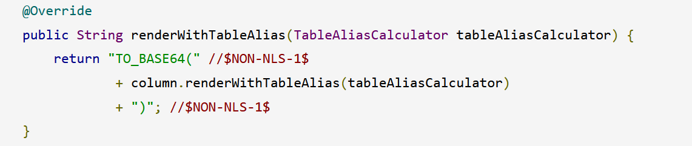


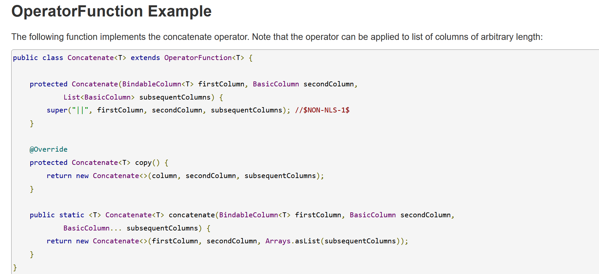


建造者模式、访问者模式


关于静态方法的记录


尝试读懂 mybatis dynamic SQL 的源码（qwq

自己从头定义一套 API 实在是太要命了。。。


很多都是以流的方式定义的：

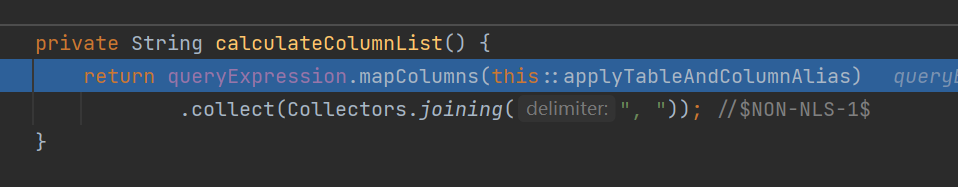

访问者模式：

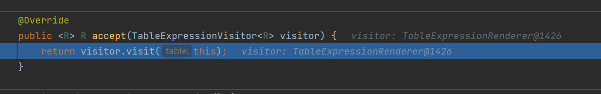


使用 Java 的记录


修改部分 mybatis dynamic sql 的源码


以目前对源码的理解程度，不能保证向外传出结构化对象的方法是可行的，故首先保证可以以传出字符串的方式实现功能。


不改变开发模式


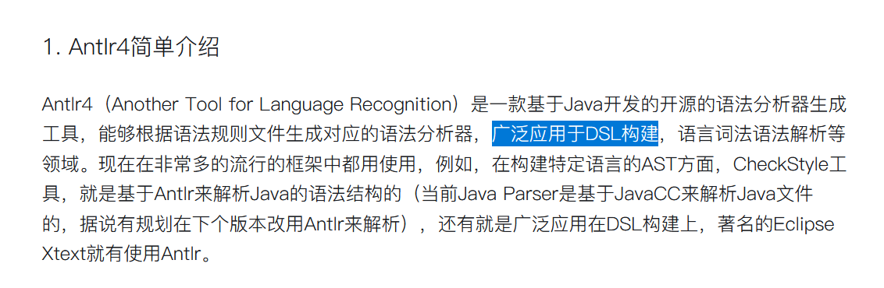


暂时不考虑与 XML 的解耦合问题，

生成过程与具体的 XML 格式解耦可以更好地满足 OCP

**2024年1月16日**

dot 语言的使用，以及示意图的绘制。


typora：alt + v


vagrant


```shell
vagrant init centos/7
vagrant up
```

SSH address: 127.0.0.1:2222
    default: SSH username: vagrant
    default: SSH auth method: private key


vagrant 实现虚拟机的端口转发

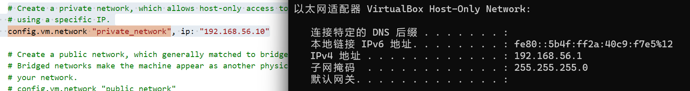

最后一次调整架构了


SQL 模板参考 queryDSL 实现。


语法规则和词法规则的区别：

词法规则纯根据优先级匹配、语法规则根据上下文尽可能匹配符合语法的规则。


关于模块化踩的坑：

只有使用者同样进行模块化，被使用模块中的访问限制才会生效。
