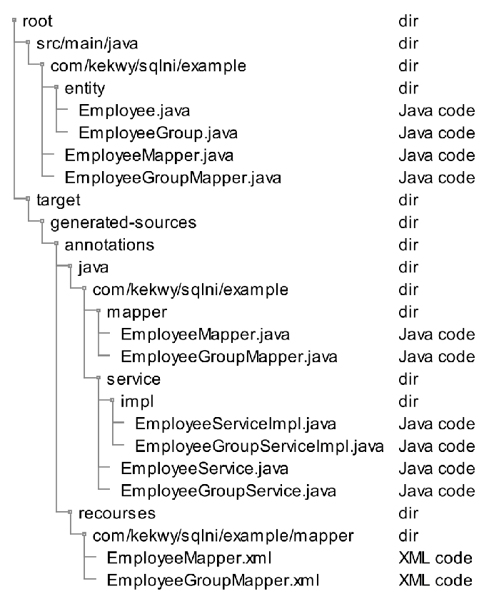
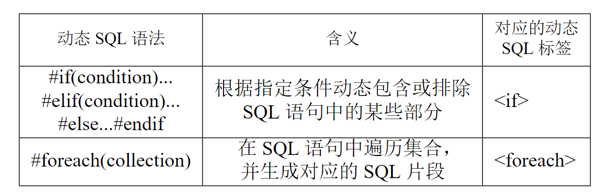

# SQLNI

<p>
    <a href="https://github.com/Kekwy"></a>
    
    <a href="https://github.com/mybatis/mybatis-3"></a>
    <a href="https://opensource.org/licenses/MIT"></a>
    
    
</p>

<div>
    
    
</div>

## 简介

SQLNI 是一个代码生成器，旨在解决软件的跨数据库移植与维护问题。SQLNI 可以根据用户定义的查询生成能够表达动态 SQL 逻辑的静态 SQL 代码，填补了支持多方言、动态SQL的同时，保留开发者对SQL代码控制权的技术空缺。

具体而言，SQLNI 采用 jDialects 实现方言转换，采用 MyBatis XML 语法以静态的代码表达动态 SQL 的逻辑。SQLNI 允许用户在方法上的注解中定义查询，并提供自定义的中间语言，使用户可以在定义查询时表达动态 SQL 语法。最终根据用户定义的查询以及指定的方言，生成包含 MyBatis 动态 SQL 标签的，用户指定方言的 SQL 语句，并保存在 XML 文件中。

同时，为使生成的 XML 文件直接可用，还在对应的软件包下生成了相关的 mapper 接口，service 接口以及 service 接口实现类。

## 核心技术

- Java 注解机制：建立用户定义的查询与 Java 方法之间的映射；
- ANTLR：定义与解析 DSL 语法以实现对动态 SQL 的支持；
- Java 注解处理机制：便于解析用户在注解中定义的查询，且可以在编译期方便地获取方法签名的各部分信息；
- jDialects：实现 SQL 语句的方言转换；
- Freemarker：生成可读性更强的代码文件。

## 快速开始

新建空项目，引入依赖 MyBatis Plus 与 SQLNI，配置注解处理器，并设置目标方言，参数“-ASQLDialect=Oracle”表示将查询语句转换为 Oracle 方言：

```xml
<dependencies>
  <dependency>
    <groupId>com.kekwy.sqlni</groupId>
    <artifactId>sqlni‐core</artifactId>
    <version >1.0‐SNAPSHOT </version>
  </dependency>
  <dependency>
    <groupId>com.baomidou </groupId>
    <artifactId>mybatis‐plus‐boot‐starter </artifactId>
    <version >3.3.1</version>
  </dependency>
</dependencies >

<build>
  <plugins>
    <plugin>
      <groupId>org.apache.maven.plugins </groupId>
      <artifactId>maven‐compiler‐plugin</artifactId>
      <version >3.8.1</version>
      <configuration >
        <source >17</source>
        <target >17</target>
        <encoding>UTF‐8</encoding>
        <annotationProcessors>
          <annotationProcessor>
            com.kekwy.sqlni.Processor
          </annotationProcessor>
        </annotationProcessors>
        <compilerArgs >
          <arg>‐ASQLDialect=Oracle</arg>
        </compilerArgs >
      </configuration >
    </plugin>
  </plugins>
</build>
```

在源代码目录下创建软件包和 Java 接口，定义 mapper 方法，并编写查询语句，其中 `#foreach` 为我们自定义的中间语言中的动态 SQL 语句：

```java
@Mapper
public interface EmployeeMapper extends BaseMapper<Employee> {
    /**
      * 选出指定的某些部门中工资最高的员工的姓名，
      * 选取其中工资最高的十名员工的部门和姓名并将其拼接。
      */
    @Select("""
            select concat(dept, '_', name) dept_name
            from t_emp
            where (dept, sal) in (
                select dept, max(sal) max_sal
                from t_emp
                where 1 = 1 #if(deptSet!=null) and dept in #foreach(#{deptSet}) #endif
                group by dept
            )
            order by sal
            limit 10;
        """)
    List<Employee> getEmployeeWithSubQuery(List<String> deptSet);
}
```

我们在启动项目构建，等待构建完成。代码生成完成之后的文件目录结构如下图所示，其中 root 为 maven 项目的根目录，图中省略了无关的目录：



我们在 `com.kekwy.sqlni.example` 下定义了两个 Mapper 接口，SQLNI 据此在“生成的源代码”目录下对应的软件包中分别生成了 Mapper 接口，Service 接口及其实现类，同时在 recourses 目录下对应的子目录中生成了 XML 文件。

上述示例查询定义在 EmployeeMapper 接口中，其对应生成的 XML 文件为 EmployeeMapper.xml。其中，与该示例对应的生成代码如下：

```xml
<!--
  选出指定的某些部门中工资最高的员工的姓名，
  选取其中工资最高的十名员工的部门和姓名并将其拼接。
-->
<select id="getEmployeeWithSubQuery" resultType="com.kekwy.sqlni.example.entity.Employee" >
  select *
  from (
  select dept|| &apos;_&apos;|| name dept_name
  from t_employee
  where (dept, sal)
  in (select dept, max(sal) max_sal
  from t_emp
  where 1 = 1
  <if test="deptSet!=null">
    and dept
    in
    <foreach separator="," item="deptSet_item" close=" " collection="deptSet" index="i" open=" ">
      #{deptSet_item}
    </foreach>
  </if>
  group by dept)
  order by sal )
  where rownum &lt;= 10;
</select>
```

## 支持的动态 SQL 语法

动态SQL语法及其对应的MyBatis动态SQL标签。



## 支持的方言

可实现对 jDialects 内置的 80 余种方言的支持。目前仅测试了 Oracle 与 MySQL 方言。
